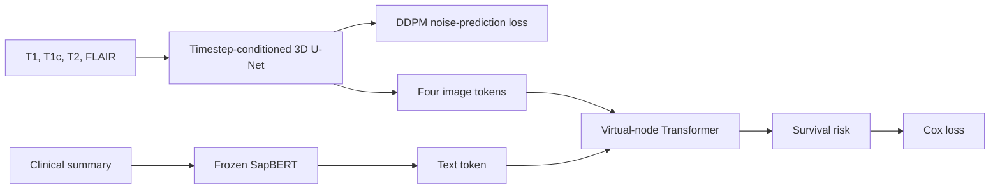

# DIVER-Surv

Official implementation of **DIVER-Surv: Diffusion and Virtual-Node Graph Fusion for Cross-Cohort Glioma Survival**.

DIVER-Surv combines four-sequence 3D MRI, frozen SapBERT clinical-text embeddings, DDPM noise-prediction training, and virtual-node Transformer fusion for survival risk prediction.

## Method overview



The training objective is

```text
L = L_surv(B1) + L_surv(B2) + 0.2 L_diff + 0.5 L_cons
```

where `B1` and `B2` are independently noised views. Survival views sample timesteps from `[0, 100]`; DDPM views sample across the full 1,000-step schedule.

## Paper configuration

The command-line defaults match the paper:

| Setting | Value |
| --- | ---: |
| Image encoder learning rate | `1e-5` |
| Survival module learning rate | `3e-6` |
| Adam weight decay | `1e-4` |
| Batch size | `8` |
| Epochs | `100` |
| Dropout | `0.2` |
| Diffusion steps | `1000` |
| Linear beta schedule | `1e-4` to `0.02` |
| Survival timestep maximum | `100` |
| Diffusion loss weight | `0.2` |
| Consistency loss weight | `0.5` |
| Fusion width | `256` |
| Transformer layers / heads | `2` / `8` |
| MRI size | `120 × 120 × 64` |
| Source split | `7:1:2` train/validation/internal test |

The implementation uses the paper's Cox, DDPM MSE, and stop-gradient consistency losses. Ranking loss and Min-SNR reweighting are not used.

## Repository layout

```text
.
├── train.py
├── configs/example.json
├── docs/
│   ├── data.md
│   └── method.md
└── survival_diffusion/
    ├── cli.py
    ├── settings.py
    ├── experiment.py
    ├── training.py
    ├── metrics.py
    ├── data/
    ├── losses/
    └── models/
```

## Installation

Python 3.10 or later is recommended. Install a PyTorch build appropriate for your CUDA environment, then install the remaining dependencies:

```bash
python -m venv .venv
source .venv/bin/activate
python -m pip install -r requirements.txt
```

The source materials did not include a locked environment, so `requirements.txt` lists package names without invented version pins.

## Data configuration

Copy the example configuration and fill in your local paths:

```bash
cp configs/example.json configs/local.json
```

```json
{
  "ucsf_csv_path": "/path/to/ucsf/metadata.csv",
  "ucsf_img_dir": "/path/to/ucsf/images",
  "upenn_csv_path": "/path/to/upenn/metadata.csv",
  "upenn_img_dir": "/path/to/upenn/images",
  "rhuh_csv_path": "/path/to/rhuh/metadata.csv",
  "rhuh_img_dir": "/path/to/rhuh/images",
  "output_root": "./outputs",
  "cache_root": "./cache",
  "wandb_entity": null,
  "wandb_project": "DIVER-Surv"
}
```

See [dataset preparation](docs/data.md) for required columns and image naming conventions. Datasets, patient summaries, model weights, and private paths are not included.

## Training

```bash
python train.py --config configs/local.json --cuda_device 0
```

The program runs the two paper settings sequentially:

1. Train on UPENN; internally test on UPENN and externally test on UCSF and RHUH.
2. Train on UCSF; internally test on UCSF and externally test on UPENN and RHUH.

Disable online W&B logging when needed:

```bash
WANDB_MODE=disabled python train.py --config configs/local.json --cuda_device 0
```

Inspect or override any paper default with:

```bash
python train.py --help
```

For example, a temporary batch-size change does not require editing source code:

```bash
python train.py --config configs/local.json --batch_size 4
```

## Outputs

Each source-cohort run writes a training log, JSON metric history, and separate image/survival checkpoints selected by validation loss and validation C-index. See [method and outputs](docs/method.md) for details.

## Reproducibility notes

- `seed1` and `seed2` control the stratified dataset splits. The current code does not globally seed PyTorch/NumPy augmentation or model initialization.
- Evaluation risk scores use clean image inputs and the median training-split risk threshold.
- The current `HR` implementation is an event-rate ratio between risk groups rather than a fitted Cox hazard ratio.
- Bootstrap confidence intervals reported in the paper are not generated by this training entry point.

## Citation

Please cite the paper if you use this repository. Replace the placeholder publication fields below when the final MICCAI bibliographic record is available.

```bibtex
@inproceedings{cho2026diversurv,
  title     = {DIVER-Surv: Diffusion and Virtual-Node Graph Fusion for Cross-Cohort Glioma Survival},
  author    = {Cho, Minji and Ra, Sinyoung and Chung, Jiwon and Park, Hyunjin},
  year      = {2026}
}
```
